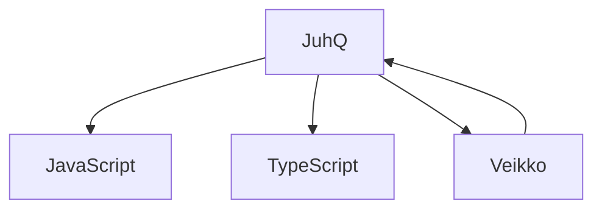

# 🦀🦆🐸🛸👽

[juhq.fi](https://juhq.fi)

> [!NOTE]
> Hello friend
> 

🥳

[My open Pull Requests](https://github.com/search?q=is%3Apr+is%3Aopen+author%3AJuhQ&sort=updated&order=desc&type=pullrequests)

    
    
    
    
    
    
    
    
    
    

